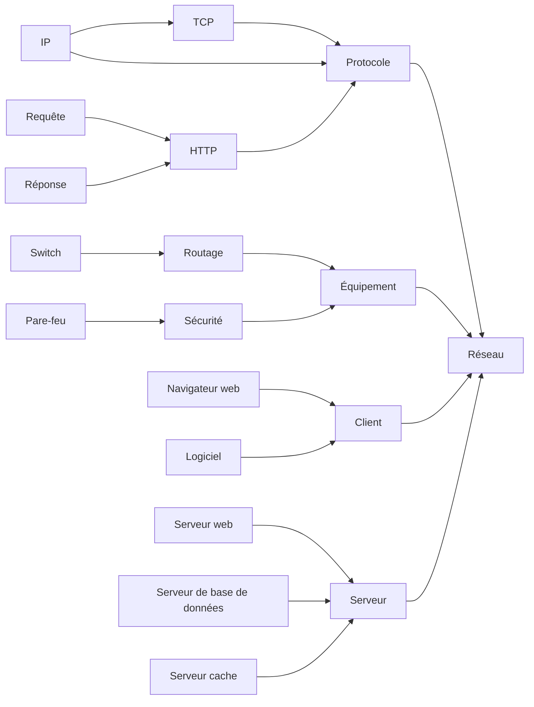

```mermaid
graph LR
    Protocole --> Réseau
    TCP --> Protocole
    IP --> TCP
    IP --> Protocole
    HTTP --> Protocole
    Requête --> HTTP
    Réponse --> HTTP

    Équipement --> Réseau
    Routage --> Équipement
    Switch --> Routage
    Sécurité --> Équipement
    Pare-feu --> Sécurité

    Navigateur[Navigateur web] --> Client
    Logiciel --> Client
    Client --> Réseau

    Frontal[Serveur web] --> Serveur
    BDD[Serveur de base de données] --> Serveur
    Cache[Serveur cache] --> Serveur
    Serveur --> Réseau

```