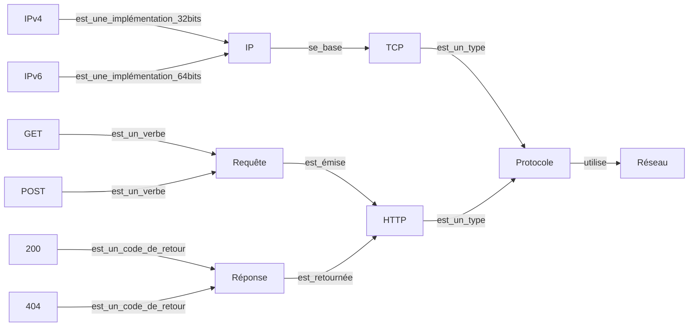

```mermaid
graph LR
    Protocole -- utilise --> Réseau
    TCP -- est_un_type --> Protocole
    IP -- se_base --> TCP
    IPv4 -- est_une_implémentation_32bits --> IP
    IPv6 -- est_une_implémentation_64bits --> IP
    HTTP -- est_un_type --> Protocole
    Requête -- est_émise --> HTTP
    GET -- est_un_verbe --> Requête
    POST -- est_un_verbe --> Requête
    Réponse -- est_retournée --> HTTP
    200 -- est_un_code_de_retour --> Réponse
    404 -- est_un_code_de_retour --> Réponse

```