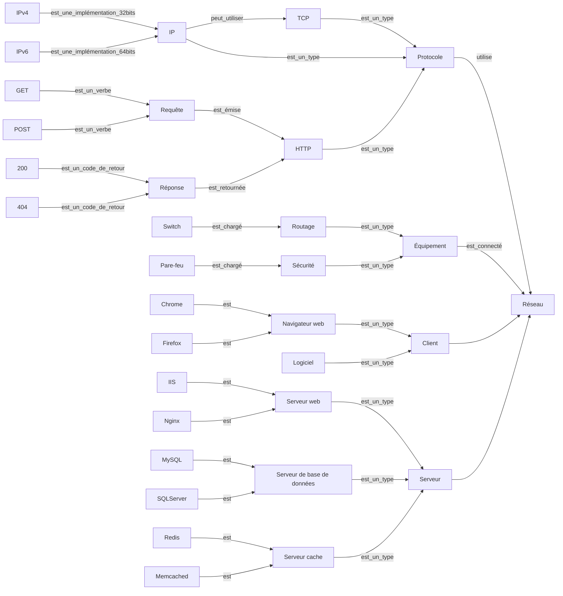

```mermaid
graph LR
    Protocole -- utilise --> Réseau
    TCP -- est_un_type --> Protocole
    IP -- peut_utiliser --> TCP
    IP -- est_un_type --> Protocole
    IPv4 -- est_une_implémentation_32bits --> IP
    IPv6 -- est_une_implémentation_64bits --> IP
    HTTP -- est_un_type --> Protocole
    Requête -- est_émise --> HTTP
    GET -- est_un_verbe --> Requête
    POST -- est_un_verbe --> Requête
    Réponse -- est_retournée --> HTTP
    200 -- est_un_code_de_retour --> Réponse
    404 -- est_un_code_de_retour --> Réponse

    Équipement -- est_connecté --> Réseau
    Routage -- est_un_type --> Équipement
    Switch -- est_chargé --> Routage
    Sécurité -- est_un_type --> Équipement
    Pare-feu -- est_chargé --> Sécurité

    Navigateur[Navigateur web] -- est_un_type --> Client
    Chrome -- est --> Navigateur
    Firefox -- est --> Navigateur
    Logiciel -- est_un_type --> Client
    Client --> Réseau

    Frontal[Serveur web] -- est_un_type --> Serveur
    IIS -- est --> Frontal
    Nginx -- est --> Frontal
    BDD[Serveur de base de données] -- est_un_type --> Serveur
    MySQL -- est --> BDD
    SQLServer -- est --> BDD
    Cache[Serveur cache] -- est_un_type --> Serveur
    Redis -- est --> Cache
    Memcached -- est --> Cache
    Serveur --> Réseau

```